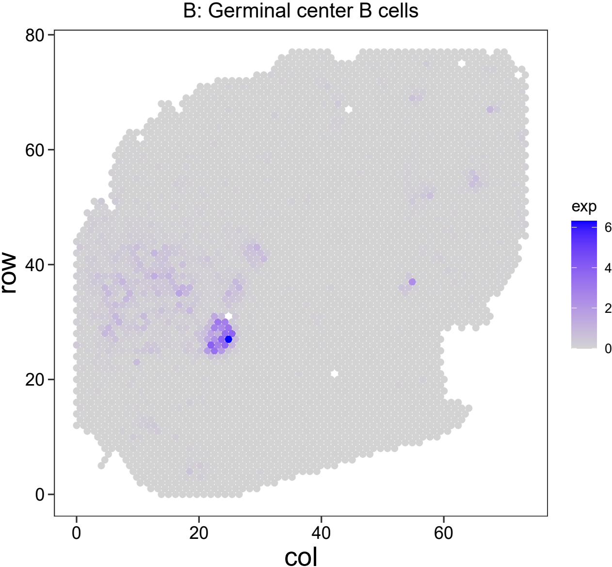
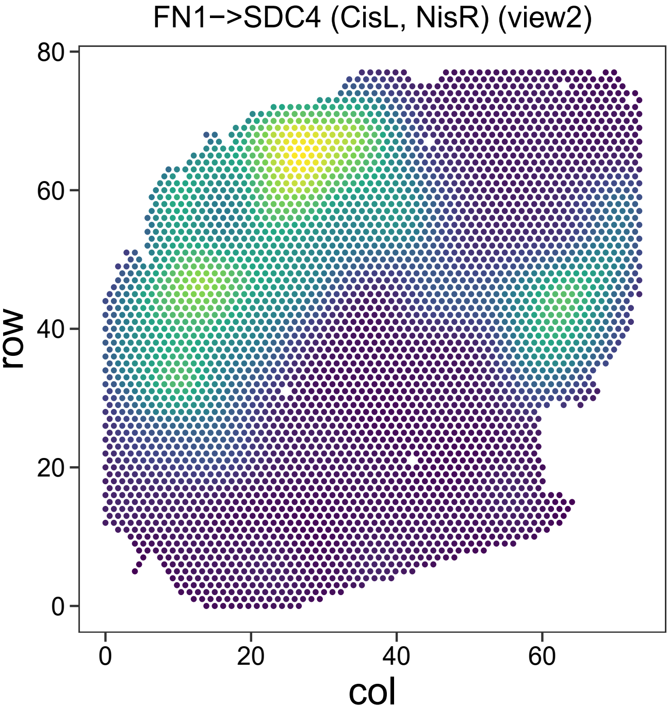
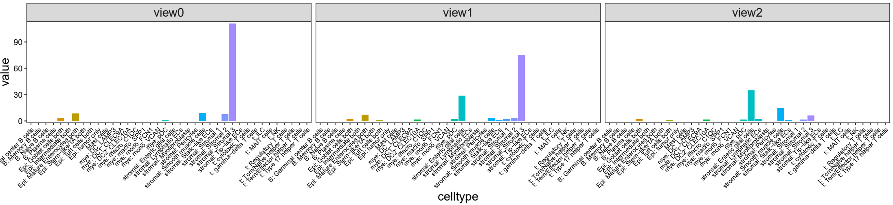
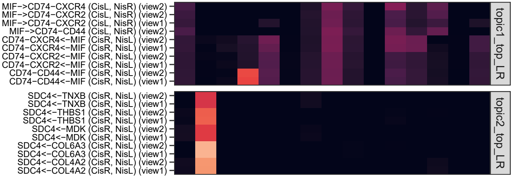
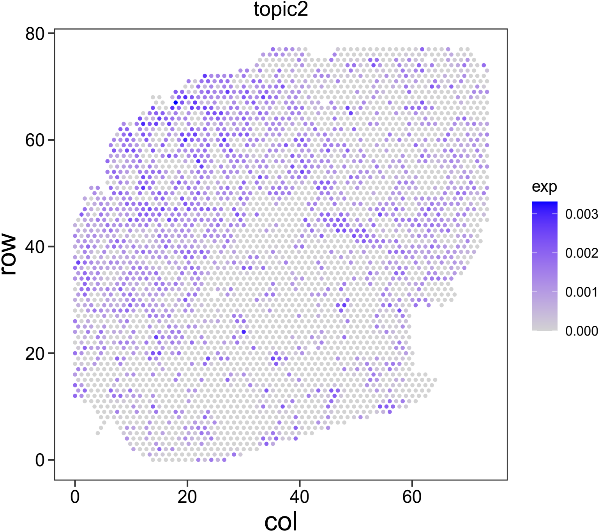

## Input data

The core algorithm of SpaNiche requires two input matrices:

-   a cell type abundance matrix

-   a ligand-receptor expression matrix

These two matrices are spatially “smoothed”/“expanded” under different
views. Views represent the spatial ranges at which we interrogate tissue
structure and function, operationalized as different spatial distances
(see the “Cellular composition” and “Cell-cell interactions” subsections
in the “Methods” section of our paper).

## How to obtain the two matrices

Taking spatial transcriptomics data generated by the 10X Visium platform
as an example, running spaceranger produces a `spatial` folder
containing image and coordinate information, as well as a
`filtered_feature_bc_matrix.h5` file containing gene expression
profiles.

The two required input matrices can then be obtained as follows: 1.
Using existing spatial transcriptomics deconvolution tools (e.g.,
cell2location or RCTD), cell type abundance can be inferred for each
spatial spot. In our paper, we mainly used cell2location because of its
strong performance, as illustrated in several other studies (as of
2024). We found that cell2location and RCTD generate similar results, in
contrast to Tangram.

1.  Based on known ligand-receptor interaction databases (from cellchat)
    and expression profiles, the ligand-receptor expression matrix can
    be constructed using built-in functions provided in SpaNiche. So
    users do not need to worry about this step.

## Detection of spatial colocalization and LR

    library(SpaNiche)
    library(Seurat)
    library(tidyverse)

    spatial.seu=Load10X_Spatial("example/ST-colon3/")
    spatial.seu=NormalizeData(spatial.seu)
    spatial.seu@meta.data$SB=rownames(spatial.seu@meta.data)
    spatialdf=spatial.seu@images$slice1@coordinates
    spatialdf$col = spatialdf$col / (3 ^ 0.5)

    spot_by_celltype=read.csv("example/ST-colon3/cell2location_map/res_spotXcelltype.csv",header = T,row.names = 1,check.names = F)

    if(identical(colnames(spatial.seu),rownames(spot_by_celltype))) {
      print("Spatial barcode is OK!")
    } else {
      stop("Please check the barcode!")
    }

    res.list = spaniche_nmf_celltype_and_lr(
      ##
      spatial.seu,
      spatialdf,
      spot_by_celltype,
      smoothing_type = c("view0", "view1", "view2"),
      distance_thre = c(NA, 2/(3^0.5), 4/(3^0.5)),
      ## LR-related parameters
      LR_dm_type = c("view1", "view2"),
      LR_distance_thre = c(2/(3^0.5), 4/(3^0.5)),
      ## Parameters related to joint factorization
      topic_num = 15,
      defined_weight = c(0.6,0.4),
      lambda_v = 0.5,
      sigma_v = 0.5
    )
    saveRDS(res.list,file = "res.list.rds")

## Exploration and Visualization of Results

#### cell type distribution

    distribution_2d(
      feature_matrix = t(spot_by_celltype),
      one_feature = "B: Germinal center B cells",
      coordinate = spatialdf[,c("col","row")] %>% mutate(SB=rownames(spatialdf)),
      thre_to_zero = 0.1, #Values below the 0.1 quantile are set to zero
      # visualization_type = "density",
      # color_palette = "viridis"
      pt.size = 2
    )

#### visualization of ligand-receptor pairs

    moransi_output_df = readRDS("LRintegratedmatrix_with_moransi.rds")
    ### Statistical summary
    stat_for_interactionwithmoransi(moransi_output_df)

    ### Distribution of interactions ###
    goodpair_file = dir(getwd(),"goodpair_MoransI_observed_.*_MoransI_p.value_.*csv")
    goodpair=read.csv(goodpair_file)
    goodpair=goodpair %>% arrange(desc(MoransI_observed))

    feature_matrix = t(res.list$LRintegratedmatrix)
    rownames(feature_matrix) = rownames(feature_matrix) %>% str_replace_all("_","-")
    distribution_2d(
      feature_matrix = feature_matrix,
      one_feature = "FN1->SDC4 (CisL, NisR) (view2)",
      coordinate = spatialdf[,c("col","row")] %>% mutate(SB=rownames(spatialdf)),
      thre_to_zero = 0.1,
      visualization_type = "density",
      color_palette = "viridis"
    )

#### Relationship between topics and cell types

> A topic is a basic unit obtained from matrix factorization. When
> considering biological meaning, it can also be defined as a niche.
> Typically, a niche is composed of multiple cell types, with complex
> and dynamic cell-cell interactions within it.

    myfit = res.list$nmf_res
    topic_num = 15

    topic_celltype = as.data.frame(myfit$H$H1)
    rownames(topic_celltype) = paste0("topic",1:topic_num)
    plot_NMF_components(topic_celltype,"topic2")

    # Heatmaps can also be used to display this
    topic_celltype_sum1 = topic_celltype %>% apply(1,function(x){x/sum(x)}) %>% t() #Normalized to sum to 1
    topic_celltype_sum1 %>% pheatmap::pheatmap(cluster_rows = F,cluster_cols = F,show_colnames = T,show_rownames = T)

#### Relationship between topics and LR pairs

    plot_topic_lr(
      topic_lr = t(myfit$H$H2),
      top_num_plot = 10,
      axis.title.size = 15,
      axis.text.x.bottom.size = 14,
      axis.text.y.left.size = 8,
      strip.text.y.size = 10
    )
    ggsave("plot_topic_lr.pdf",width = 20,height = 45,units = "cm")

#### Distribution of topics

    spot_topic = as.data.frame(myfit$W)
    colnames(spot_topic) = paste0("topic",1:topic_num)
    distribution_2d(
      feature_matrix = t(spot_topic),
      one_feature = "topic2",
      coordinate = spatialdf[,c("col","row")] %>% mutate(SB=rownames(spatialdf)),
      thre_to_zero = 0.1,
      # visualization_type = "density",
      # color_palette = "viridis"
    )

**Note:** SpaNiche currently relies on Seurat v4 internally. Support for
Seurat v5 will be added in future releases.
