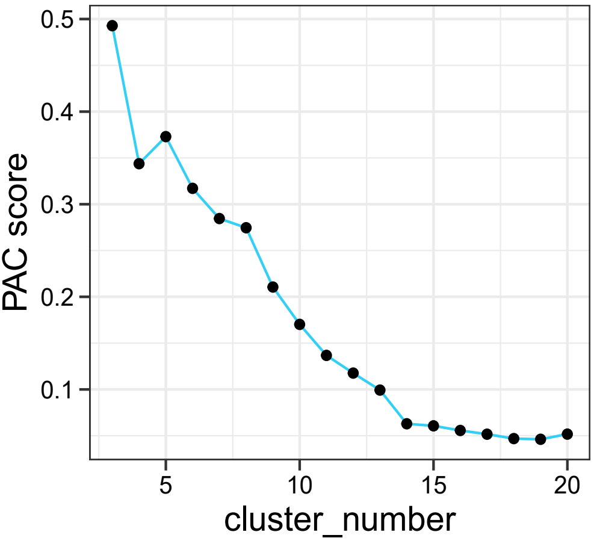
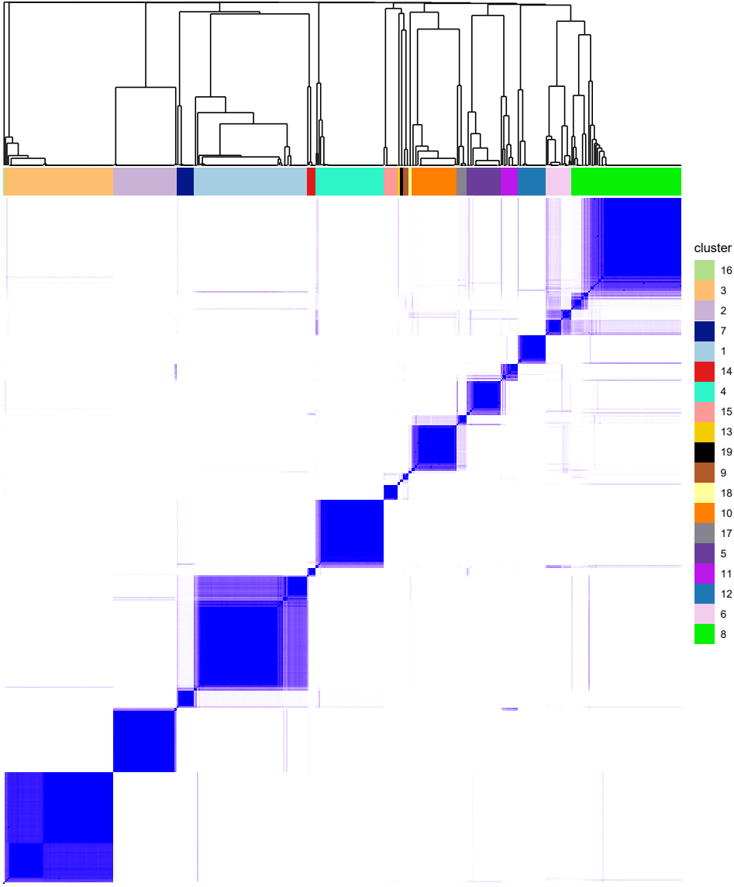
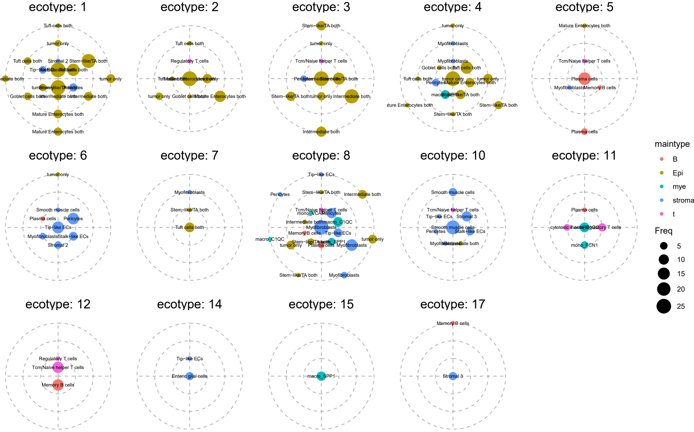
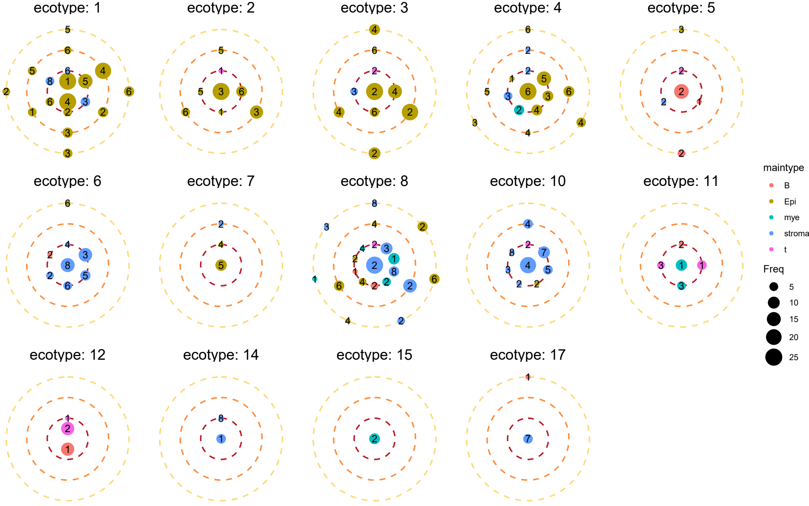

Ecotype analysis is one of the key features of SpaNiche. In our original
paper, we comprehensively demonstrated different aspects of ecotype
analysis using a colorectal cancer dataset. This analytical framework
can also be applied to non-tumor datasets, as demonstrated in our paper.

## Dataset

All samples were obtained from publicly available datasets. Information
regarding raw data acquisition and the original publications can be
found in the `Data availability` section of our paper. Here, we provide
the initial results generated by SpaNiche (the `output` directory):

-   Google Drive
    <https://drive.google.com/drive/folders/1smKf_Nnkhc9FP_z2uFbA6_3QE2vJA4Am?usp=sharing>
-   百度网盘 <https://pan.baidu.com/s/1l7g5skCZkaz6MIpzvH8F4w> 提取码:
    7bsc

## Analysis workflow

### 1 Organizing the initial results

    library(tidyverse)
    library(SpaNiche)
    library(pheatmap)
    library(RColorBrewer)
    library(scales)

    topic_num = 15

    output_path="D:/hsy/project/202207Xi/06.analysis/CRC/output/"
    output_dirs = dir(output_path)
    output_dirs=setdiff(output_dirs,"Human_Colorectal_Cancer_11_mm_Capture_Area_FFPE")

    alldf = data.frame()
    for (di in output_dirs) {
      tmpres = readRDS(paste0(output_path,di,"/res.list.rds"))
      myfit = tmpres$nmf_res

      # Relationship between topics and cell types
      topic_celltype = as.data.frame(myfit$H$H1)
      rownames(topic_celltype) = paste0("topic",1:topic_num)
      ## Ensure that column names follow the celltype_view format.
      ## Earlier versions of the package used the term "loop",
      ## so we rename them here.
      colnames(topic_celltype) = colnames(topic_celltype) %>% str_replace(pattern = "loop1\\+loop2",replacement = "view2") %>% str_replace(pattern = "loop1",replacement = "view1")
      
      
      # Generate expanded barplots
      tmpdir = paste0("./01.module/barplot/",di)
      if(!dir.exists(tmpdir)){dir.create(tmpdir,recursive = T)}

      for (ti in rownames(topic_celltype)) {
        plot_NMF_components(topic_celltype,ti)
        ggsave(paste0(tmpdir,"/",ti,".png"),width = 80,height = 40,units = "cm")
      }

      #topic_celltype %>% pheatmap(cluster_rows = F,cluster_cols = F,show_colnames = T,show_rownames = T)
      topic_celltype_sum1 = topic_celltype %>% apply(1,function(x){x/sum(x)}) %>% t() # Normalize each row to sum to 1
      pheatmap(
        topic_celltype_sum1,
        cluster_rows = F,
        cluster_cols = F,
        show_colnames = T,
        show_rownames = T,
        filename = paste0("01.module/celltype_topic_",di,".pdf"),width = 17,height = 8
      )

      # Export data
      rownames(topic_celltype) = paste(di,rownames(topic_celltype),sep = ":")
      if(di == "C1"){
        alldf = topic_celltype
      } else {
        if(identical(colnames(alldf),colnames(topic_celltype))){print("colnames ok!")}
        alldf = rbind(alldf,topic_celltype)
      }
    }

After this step, alldf contains the merged matrix of sample\_topic ×
celltype\_view across all samples, with a format similar to the
following:

    # > alldf[1:4,1:4]
    #           B: Germinal center B cells B: Memory B cells B: Naive B cells B: Plasma cells
    # C1:topic1                          0        0.00000000       0.03647268               0
    # C1:topic2                          0        0.00000000       0.00000000               0
    # C1:topic3                          0        0.04636569       0.04267916               0
    # C1:topic4                          0        0.00000000       0.00000000               0

To identify ecotypes that are consistently present across different
samples, clustering analysis is required. The main strategies include
correlation-based clustering and consensus clustering (the latter was
adopted in our paper).

### 2.1 Correlation-based clustering

    alldf=as.data.frame(t(alldf))
    cordf = cor(alldf)

    ### Add annotations
    annodf = colnames(alldf) %>% as.data.frame()
    colnames(annodf) = "sample_topic"
    annodf$sample = annodf$sample_topic %>% str_remove(":.*$")
    annodf$topic = annodf$sample_topic %>% str_remove("^.*:")
    rownames(annodf)=annodf$sample_topic
    annodf$sample_topic=NULL

    ### Add color
    # color_topic = c(
    #   brewer.pal(12, "Set3")[-c(2,9,12)],"#b3b3b3",
    #   brewer.pal(5, "Set1")[-1],
    #   brewer.pal(3, "Dark2")[-2],
    #   "#fc4e2a","#e7298a"
    # )
    # names(color_topic) = annodf$topic %>% unique()
    # color_sample = brewer.pal(11, "Paired")
    # names(color_sample) = annodf$sample %>% unique()

    pheatmap(
      cordf,
      annotation_col = annodf,annotation_row = annodf,
      #annotation_colors = list(sample = color_sample),
      border_color = NA,
      filename = "01.module/find_module.1019.pdf",width = 39,height = 34
    )

### 2.2 Consensus clustering

Consensus clustering generally produces more robust results, which is
why we adopted this approach in the paper.

    library(ConsensusClusterPlus)
    d=as.matrix(alldf) 
    # Input matrix for clustering:
    # columns represent samples and rows represent features
    title="01.module/ConsensusClusterPlus"
    if(!dir.exists(title)){dir.create(title,recursive = T)}
    maxK=20

    results = ConsensusClusterPlus(
      d,
      maxK=maxK,reps=1000,
      title=title,
      seed=123456,
      plot="png" #pdf, png
    )

PAC-based selection of the optimal K

    Kvec = 3:maxK
    x1 = 0.1; x2 = 0.9 # threshold defining the intermediate sub-interval
    PAC = rep(NA,length(Kvec))
    names(PAC) = paste("K=",Kvec,sep="") # from 3 to maxK

    for(i in Kvec){
      M = results[[i]]$consensusMatrix
      Fn = ecdf(M[lower.tri(M)])
      PAC[i-2] = Fn(x2) - Fn(x1)
    }#end for i

    # The optimal K
    optK = Kvec[which.min(PAC)]

    # plot 20231114
    pacdf = as.data.frame(PAC)
    pacdf$cluster_number = rownames(pacdf) %>% str_remove("K=") %>% as.numeric()
    pacdf %>% ggplot(aes(x=cluster_number,y=PAC))+
      geom_line(color="#33cff5")+
      geom_point()+
      scale_y_continuous("PAC score")+
      theme_bw()+
      theme(
        axis.text.x.bottom = element_text(size = 10,color = "black"),
        axis.text.y.left = element_text(size = 10,color = "black"),
        axis.ticks.length = unit(0.15,"cm"),
        axis.title = element_text(size = 14,color = "black")
      )
    ggsave("01.module/ConsensusClusterPlus/pac.pdf",width = 9,height = 8,units = "cm")

When the number of modules was set to 19, the PAC score reached its
minimum value. Therefore, we selected K = 19.

We also need to save the module assignment information for each topic.

    ### Important information for the heatmap
    # # Export cluster labels and color codes following the order of records in the original consensus heatmap
    # # Cluster label for each observation
    # results[[optK]][["consensusClass"]][results[[optK]][["consensusTree"]]$order]
    # # Color code for each observation
    # results[[optK]]$clrs[[1]][results[[optK]][["consensusTree"]]$order]

    hcinfo = data.frame(
      "sample_topic" = names(results[[optK]][["consensusClass"]][results[[optK]][["consensusTree"]]$order]),
      "cluster" = as.numeric(results[[optK]][["consensusClass"]][results[[optK]][["consensusTree"]]$order]),
      "color_code" = results[[optK]]$clrs[[1]][results[[optK]][["consensusTree"]]$order]
    )
    hcinfo$sample = hcinfo$sample_topic %>% str_remove(":.*$")
    hcinfo$topic = hcinfo$sample_topic %>% str_remove("^.*:")
    # Count the number of samples in which each module appears
    tmpdf = hcinfo[,c("cluster","sample")] %>% unique()
    tmpdf2 = as.data.frame(table(tmpdf$cluster) %>% sort())
    colnames(tmpdf2) = c("cluster","unique_sample_num")
    tmpdf2$cluster = as.numeric(as.character(tmpdf2$cluster))
    hcinfo=hcinfo %>% left_join(tmpdf2,by = "cluster")
    # Save results
    write.csv(hcinfo,file = paste(title,"hcinfo.csv",sep = "/"),quote = T,row.names = F)

Generate customized plots

    # plot 20231114
    library(ggdendro)
    library(aplot)
    # remotes::install_version("aplot", version = "0.1.8")
    # If the version of aplot is too high, the plot code below may generate error.

    hc=results[[optK]][["consensusTree"]]
    ct = cutree(hc, optK)
    identical(ct,as.integer(results[[optK]][["consensusClass"]]))

    pa=ggdendrogram(hc,theme_dendro = FALSE)+
      scale_y_continuous(expand=c(0,0))+
      scale_x_continuous(expand=c(0,0))+
      theme_void()

    tiledf = data.frame(
      "sample_topic" = names(results[[optK]][["consensusClass"]][results[[optK]][["consensusTree"]]$order]),
      "cluster" = as.numeric(results[[optK]][["consensusClass"]][results[[optK]][["consensusTree"]]$order]),
      "color_code" = results[[optK]]$clrs[[1]][results[[optK]][["consensusTree"]]$order]
    )
    tiledf$cluster = as.character(tiledf$cluster)
    tiledf$cluster = factor(tiledf$cluster,levels = tiledf$cluster %>%unique())
    tiledf$sample_topic = factor(tiledf$sample_topic,levels = tiledf$sample_topic)
    color_tile = tiledf$color_code %>%unique()
    names(color_tile) = tiledf$cluster %>%levels()

    pb = tiledf %>% ggplot(aes(x=sample_topic,y=1))+
      geom_tile(aes(fill=cluster))+
      scale_y_continuous(expand=c(0.1,0))+
      scale_x_discrete(expand=c(0,0))+
      scale_fill_manual(values = color_tile)+
      theme_void()

    sample_topic = names(results[[optK]][["consensusClass"]][results[[optK]][["consensusTree"]]$order])
    hmdf = results[[optK]][["consensusMatrix"]][
      results[[optK]][["consensusTree"]]$order %>% rev(),
      results[[optK]][["consensusTree"]]$order]
    hmdf = as.data.frame(hmdf)
    colnames(hmdf) = sample_topic
    rownames(hmdf) = sample_topic %>% rev()
    hmdf$row = rownames(hmdf)
    hmdf = hmdf%>%reshape2::melt(id.vars=c("row"))
    colnames(hmdf)[2:3] = c("col","value")

    hmdf$row = factor(hmdf$row,levels = sample_topic)
    hmdf$col = factor(hmdf$col,levels = sample_topic)

    pc = hmdf %>% ggplot(aes(x=col,y=row))+
      geom_tile(aes(fill = value))+
      scale_y_discrete(expand=c(0,0))+
      scale_x_discrete(expand=c(0,0))+
      scale_fill_gradient(low = "white",high = "blue")+
      theme_void()+
      theme(
        legend.position = "none"
      )

    pb %>% insert_top(pa,height=5) %>% insert_bottom(pc,height = 21)
    ggsave("01.module/ConsensusClusterPlus/consensus_matrix_new.pdf",width = 22.5,height = 27,units = "cm")

This figure corresponds to Fig. S6b in our paper.

### 3 Visualization of ecotype

This section is relatively complex and involves multiple data-processing
steps.

    library(tidyverse)
    topic_num = 15
    min_threshold = 0.03
    min_threshold2 = 10
    dimn = 38*3 # number of celltype_view
    max_st = 25
    # Here we manually limit the maximum occurrence count of sample_topic within one module to facilitate plotting
    # This value is preferably slightly smaller than the total number of spatial transcriptomics samples

    output_path = "D:/hsy/project/202207Xi/06.analysis/CRC/output/"
    # Location of the original SpaNiche output results
    # These are the data stored in the cloud drive link mentioned earlier

    hcinfo = read.csv("01.module/ConsensusClusterPlus/hcinfo.csv",header = T)
    plotdata = data.frame()
    anno_st=c()
    anno_cluster=c()
    anno_info=c()
    for (ci in unique(hcinfo$cluster)) {
      print(ci)
      
      tmpdf = hcinfo %>% filter(cluster == ci) %>% as.data.frame()
      unique_sample_num = tmpdf$unique_sample_num %>% unique()

      if(unique_sample_num == 1){
        # Clusters/modules appearing in only one sample are not further analyzed
        next
      } else if( unique_sample_num > 1){
        one_cluster_df = matrix(nrow = dimn,ncol = nrow(tmpdf))
        for (sti in 1:nrow(tmpdf)) {
          tmpres = readRDS(paste0(output_path,tmpdf[sti,"sample"],"/res.list.rds"))
          myfit = tmpres$nmf_res

          # Relationship between topic and cell type
          topic_celltype = as.data.frame(myfit$H$H1)
          rownames(topic_celltype) = paste0("topic",1:topic_num)
          one_topic = tmpdf[sti,"topic"]
          one_topic_sum = topic_celltype[one_topic,] %>% as.numeric() %>% sum()
          one_topic_sum_min_threshold = one_topic_sum * min_threshold
          # This threshold is used to evaluate whether a celltype_view is important within a given topic

          one_topic_df = as.data.frame(t(topic_celltype[one_topic,]))
          one_topic_df[one_topic_df < one_topic_sum_min_threshold] = 0
          # Adjustment based on the relative threshold
          one_topic_df[one_topic_df < min_threshold2] = 0
          # Adjustment based on the absolute threshold
          one_topic_df[one_topic_df > 0] = 1
          # Replace larger values directly with 1

          # Merge
          one_cluster_df[,sti] = one_topic_df[,1]
        } # loop end
        one_cluster_df = as.data.frame(one_cluster_df)
        colnames(one_cluster_df) = tmpdf$sample_topic
        rownames(one_cluster_df) = rownames(one_topic_df)
      } # if end
      gc()

      ### If there are empty columns, they must be removed at this step!!!
      tmpsum = sum(colSums(one_cluster_df) > 0)
      if (tmpsum == 0) {
        next
      } else if (tmpsum == 1) {
        # If only one sample topic passes the filtering criteria, it is not considered because it lacks generality
        next
      } else {
        one_cluster_df = one_cluster_df[,colSums(one_cluster_df) > 0]
      }

      ### Continue organizing the data
      st_num = ncol(one_cluster_df)
      one_cluster_df$sum = rowSums(one_cluster_df)
      one_cluster_df$celltype_expand = rownames(one_cluster_df)
      one_cluster_df = one_cluster_df %>% filter(sum > 0)
      one_cluster_df$loop = ifelse(one_cluster_df$celltype_expand %>% str_detect("_loop1\\+loop2"),"view2",
                                   ifelse(one_cluster_df$celltype_expand %>% str_detect("_loop1"),"view1","view0"))

      # Export annotation information for hcinfo.csv
      for ( sti in 1:st_num) {
        tmpdf_small = one_cluster_df[,c(sti,st_num+2,st_num+3)]
        tmpdf_small = tmpdf_small[tmpdf_small[,1] > 0,]
        tmpdf_small$celltype = tmpdf_small$celltype_expand %>% str_remove("_loop1\\+loop2") %>% str_remove("_loop1")

        tmpv = c()
        for (li in unique(tmpdf_small$loop)) {
          tmpchr = tmpdf_small[tmpdf_small$loop == li,"celltype"] %>% paste(collapse = ",")
          tmpchr = paste0(li,"(",tmpchr,")")
          tmpv = c(tmpv,tmpchr)
        }
        tmpv = paste(tmpv,collapse = ";")

        anno_st = append(anno_st,colnames(tmpdf_small)[1])
        anno_cluster = append(anno_cluster,ci)
        anno_info = append(anno_info,tmpv)
      }
      # loop end
      # anno_st, anno_cluster, and anno_info will later be used to reconstruct a data frame

      alldf = data.frame()
    # Here, alldf represents the representative cell types (across different views) of all sample_topics within a module
      for ( sti in 1:st_num) {
        # For a given sample_topic, determine the representative cell types across different views
        tmpdf_small = one_cluster_df[,c(sti,st_num+2,st_num+3)]
        tmpdf_small = tmpdf_small[tmpdf_small[,1] > 0,]
        tmpdf_small$celltype = tmpdf_small$celltype_expand %>% str_remove("_loop1\\+loop2") %>% str_remove("_loop1")
        tmpdf_small=tmpdf_small[!duplicated(tmpdf_small$celltype),]

        tmpdf_small[,1] = colnames(tmpdf_small)[1]
        colnames(tmpdf_small)[1] = "sample_topic"

        alldf=alldf%>%rbind(tmpdf_small)
      }

      Var1Freq = table(alldf$celltype_expand) %>% as.data.frame()
      Var1Freq$Var1 = as.character(Var1Freq$Var1)
      Var1Freq = Var1Freq %>% arrange(Var1)
      alldf2 = alldf[,2:4] %>% unique()
      alldf2$celltype_expand = as.character(alldf2$celltype_expand)
      alldf2 = alldf2 %>% arrange(celltype_expand)
      #identical(Var1Freq$Var1,alldf2$celltype_expand)
      if (identical(Var1Freq$Var1,alldf2$celltype_expand)) {
        print("Continue...")
        alldf2$Freq = Var1Freq$Freq
        alldf2 = alldf2 %>% arrange(loop,desc(Freq),celltype)
        alldf2$Freq[alldf2$Freq > max_st] = max_st
      } else {
        stop("The two vectors are inconsistent. The error occurred near line 397.")
      }

      # Organize the data into the input format for ecotype pattern visualization
      tmpmax = alldf2$Freq %>% max()
      if(sum(alldf2$Freq == tmpmax) == 1) {
        # A single maximum value exists (center of the pattern plot)
        if (alldf2$loop[alldf2$Freq == tmpmax] == "view0") {
          alldf2$loop[alldf2$Freq == tmpmax] = "center"
        }
        tmpfreq = table(alldf2$loop)
        alldf3 = data.frame()
        for (li in names(tmpfreq)) {
          smalldf = alldf2 %>% filter(loop == li) %>% as.data.frame()
          if(li == "center"){
            smalldf$x = 0
            smalldf$y = 0
          }
          if(li == "view0"){
            smalldf$x = 10 / dim(smalldf)[1] * (1:dim(smalldf)[1])
            smalldf$y = 1
          }
          if(li == "view1"){
            smalldf$x = 10 / dim(smalldf)[1] * (1:dim(smalldf)[1])
            smalldf$y = 2
          }
          if(li == "view2"){
            smalldf$x = 10 / dim(smalldf)[1] * (1:dim(smalldf)[1])
            smalldf$y = 3
          }
          alldf3 = rbind(alldf3,smalldf)
        }
      } else if(sum(alldf2$Freq == tmpmax) > 1) {
        # Multiple maximum values exist
        if (tmpmax != 1 &
            ((alldf2$loop[alldf2$Freq == tmpmax] == "view0")%>%as.numeric()%>%prod() == 1)
        ) {
          alldf2$loop[alldf2$Freq == tmpmax] = "center"
        }
        tmpfreq = table(alldf2$loop)
        alldf3 = data.frame()
        for (li in names(tmpfreq)) {
          smalldf = alldf2 %>% filter(loop == li) %>% as.data.frame()
          if(li == "center"){
            smalldf$x = 10 / dim(smalldf)[1] * (1:dim(smalldf)[1])
            smalldf$y = 0.5
          }
          if(li == "view0"){
            smalldf$x = 10 / dim(smalldf)[1] * (1:dim(smalldf)[1])
            smalldf$y = 1
          }
          if(li == "view1"){
            smalldf$x = 10 / dim(smalldf)[1] * (1:dim(smalldf)[1])
            smalldf$y = 2
          }
          if(li == "view2"){
            smalldf$x = 10 / dim(smalldf)[1] * (1:dim(smalldf)[1])
            smalldf$y = 3
          }
          alldf3 = rbind(alldf3,smalldf)
        }
      } else {}

      alldf3$maintype = alldf3$celltype %>% str_remove(": .*$")
      alldf3$subtype = alldf3$celltype %>% str_remove("^.*: ")
      alldf3$cluster = ci

      # Merge
      plotdata = rbind(plotdata,alldf3)
    } # cluster loop end
    rownames(plotdata) = NULL # Row names are duplicated, so they should be reset
    if(!dir.exists("./01.module/ecotype/")){
      dir.create("./01.module/ecotype/",recursive = T)
      }
    saveRDS(plotdata,file = "./01.module/ecotype/plotdata.rds")

    # Another important file
    annodf = data.frame("sample_topic" = anno_st,"cluster" = anno_cluster,"anno" = anno_info)
    write.csv(annodf,file = "./01.module/ecotype/hcinfo_anno.csv",quote = T,row.names = F)

plotdata is a key intermediate data.frame for ecotype visualization.
Even revisiting this part of the code today, I still find it both
complex and elegant. (20260510)

Start plotting below.

    plotdata$ecotype = paste0("ecotype: ",plotdata$cluster)
    plotdata$ecotype = factor(plotdata$ecotype,levels = paste0("ecotype: ",unique(hcinfo$cluster)))
    library(scales)
    maintype_color = hue_pal()(6)
    names(maintype_color) = c("B","Epi","Mast cells","mye","stromal","t")

    ggplot(data = plotdata %>% filter(Freq > 2),aes(x,y))+
      # Remove points with frequencies that are too low
      geom_hline(yintercept = c(1,2,3),color = "grey",linetype = "dashed",alpha = 0.7)+
      geom_vline(xintercept = c(2.5,5,7.5,10),color = "grey",linetype = "dashed",alpha = 0.7)+
      geom_point(aes(size = Freq,color = maintype))+
      # Here, Freq represents the occurrence frequency of sample_topic
      geom_text(aes(label = subtype),size = 2)+
      scale_x_continuous(expand = c(0,0),limits = c(0,10))+
      scale_y_continuous(expand = c(0,0),limits = c(0,3))+
      scale_size_continuous(range=c(2,8))+
      scale_color_manual(values = maintype_color)+
      coord_polar(theta = "x")+theme(legend.position = "none")+
      facet_wrap(~ecotype,ncol = 4)+
      theme_bw()+
      theme(
        panel.grid.minor = element_blank(),
        panel.grid.major = element_blank(),
        axis.text = element_blank(),
        axis.title = element_blank(),
        axis.ticks = element_blank(),

        panel.spacing.x = unit(0,"cm"),
        strip.text.x = element_text(size = 14),
        #strip.background.x = element_rect(fill = "red"),
      )
    ggsave(paste0("./01.module/ecotype/spatial_ecotype_filterFreq2.pdf"),width = 45,height = 40,units = "cm")

    ### Added on 20231114
    plotdata = readRDS("./01.module/ecotype/plotdata.rds")
    plotdata = plotdata %>% filter(Freq > 2)
    plotdata$ecotype = paste0("ecotype: ",plotdata$cluster)
    plotdata$ecotype = factor(plotdata$ecotype,levels = paste0("ecotype: ",intersect(1:1000,unique(hcinfo$cluster))))

    library(scales)
    maintype_color = hue_pal()(6)
    names(maintype_color) = c("B","Epi","Mast cells","mye","stromal","t")

    # Adjust plotting values to improve figure appearance
    plotdata2 = data.frame()
    for (ei in levels(plotdata$ecotype)) {
      smallpd = plotdata %>% filter(ecotype == ei)
      loopv = unique(smallpd$loop)
      
      for (li in loopv) {
        smallsmallpd = smallpd %>% filter(loop == li)
        if (li == "center") {
          # No modification is needed temporarily
        } else {
          tmpnum = nrow(smallsmallpd)
          smallsmallpd$x = (10 / tmpnum) * (1:tmpnum)
        }
        plotdata2 = rbind(plotdata2,smallsmallpd)
      } # end
    } # end

    ggplot(data = plotdata2,aes(x,y))+
      geom_hline(yintercept = c(1,2,3),color = "#969696",linetype = "dashed",alpha = 0.7)+
      geom_vline(xintercept = c(2.5,5,7.5,10),color = "#969696",linetype = "dashed",alpha = 0.7)+
      geom_point(aes(size = Freq,color = maintype))+
      geom_text(aes(label = subtype),size = 2)+
      scale_x_continuous(expand = c(0,0),limits = c(0,10))+
      scale_y_continuous(expand = c(0,0),limits = c(0,3))+
      scale_size_continuous(range=c(2,8))+
      scale_color_manual(values = maintype_color)+
      coord_polar(theta = "x")+theme(legend.position = "none")+
      facet_wrap(~ecotype,ncol = 5)+
      #theme_bw()+
      theme_void()+
      theme(
        #panel.grid.minor = element_blank(),
        #panel.grid.major = element_blank(),
        axis.text = element_blank(),
        axis.title = element_blank(),
        axis.ticks = element_blank(),
        
        panel.spacing.x = unit(0,"cm"),
        strip.text.x = element_text(size = 16),
        #strip.background.x = element_rect(fill = "red"),
      )
    ggsave(paste0("./01.module/ecotype/spatial_ecotype_new.pdf"),width = 45*0.7,height = 30*0.7,units = "cm")

The pattern plot used in our paper was further refined. Compared with
the figure above, the code changes are relatively minor.

If you prefer the visualization shown in Fig. 3a of our paper, you can
use the code below:

    ### 2025.12.16
    hcinfo = read.csv("01.module/ConsensusClusterPlus/hcinfo.csv",header = T)

    plotdata = readRDS("01.module/ecotype/plotdata.rds")
    plotdata = plotdata %>% filter(Freq > 2)
    plotdata$ecotype = paste0("ecotype: ",plotdata$cluster)
    plotdata$ecotype = factor(plotdata$ecotype,levels = paste0("ecotype: ",intersect(1:1000,unique(hcinfo$cluster))))

    library(scales)
    maintype_color = hue_pal()(6)
    names(maintype_color) = c("B","Epi","Mast cells","mye","stromal","t")

    plotdata2 = data.frame()
    for (ei in levels(plotdata$ecotype)) {
      smallpd = plotdata %>% filter(ecotype == ei)
      loopv = unique(smallpd$loop)
      
      for (li in loopv) {
        smallsmallpd = smallpd %>% filter(loop == li)
        if (li == "center") {
        } else {
          tmpnum = nrow(smallsmallpd)
          smallsmallpd$x = (10 / tmpnum) * (1:tmpnum)
        }
        plotdata2 = rbind(plotdata2,smallsmallpd)
      }
    }

    plotdata2$subtype = plotdata2$subtype %>% str_replace_all(pattern = "both",replacement = "N/T")

    msdf = plotdata2[,c("maintype","subtype")] %>% unique()
    msdf = msdf %>% arrange(maintype,subtype)
    msdf$index = c(1:2,1:6,1:4,1:8,1:3)
    msdf$subtype_new = paste(msdf$maintype,msdf$index,sep = "_")
    msdf$y = 23:1
    msdf %>% ggplot(aes(x=0,y=y))+
      geom_point(aes(color=maintype),size = 5)+
      geom_text(aes(label = index))+
      geom_text(aes(x=1,label = subtype),hjust = 0)+
      scale_x_continuous(limits = c(0,6))+
      scale_color_manual(values = maintype_color)+
      theme_void()
    ggsave("01.module/ecotype/ecotype_legend.pdf",width = 8,height = 15,units = "cm")

    plotdata2 = plotdata2 %>% left_join(msdf[,c("subtype","index","subtype_new")],by = "subtype")

    ggplot(data = plotdata2,aes(x,y))+
      geom_hline(yintercept = c(1),color = "#bd1a26",linetype = "dashed",linewidth = 0.75)+
      geom_hline(yintercept = c(2),color = "#fd8d3c",linetype = "dashed",linewidth = 0.75)+
      geom_hline(yintercept = c(3),color = "#fed976",linetype = "dashed",linewidth = 0.75)+
      geom_point(aes(size = Freq,color = maintype))+
      geom_text(aes(label = index),size = 4)+
      scale_x_continuous(expand = c(0,0),limits = c(0,10))+
      scale_y_continuous(expand = c(0,0),limits = c(0,3))+
      scale_size_continuous(range=c(2,8))+
      scale_color_manual(values = maintype_color)+
      coord_polar(theta = "x")+theme(legend.position = "none")+
      facet_wrap(~ecotype,ncol = 5)+
      theme_void()+
      theme(
        axis.text = element_blank(),
        axis.title = element_blank(),
        axis.ticks = element_blank(),
        
        panel.spacing.x = unit(0,"cm"),
        strip.text.x = element_text(size = 16)
      )
    ggsave(paste0("01.module/ecotype/spatial_ecotype_new.1216.pdf"),width = 31.5,height = 21,units = "cm")

### 4 Plot the distribution of topics within the same ecotype

    topic_num = 15
    hcinfo = read.csv("./01.module/ecotype/hcinfo_anno.csv",header = T)
    hcinfo$sample = hcinfo$sample_topic %>% str_remove(":.*$")
    hcinfo$topic = hcinfo$sample_topic %>% str_remove("^.*:")
    pathdf <- read_excel("some_path.xlsx") %>% as.data.frame()
    # This file records the paths of important files for all samples, facilitating batch processing

    if(!dir.exists("./01.module/ecotype_dis")){
      dir.create("./01.module/ecotype_dis",recursive = T)
    }

    for (ci in unique(hcinfo$cluster)) {
      tmpdf = hcinfo %>% filter(cluster == ci) %>% as.data.frame()
      
      plot.list=list()
      for (sti in 1:nrow(tmpdf)) {
        one_sample = tmpdf[sti,"sample"]
        one_topic = tmpdf[sti,"topic"]
        path_out = pathdf[pathdf$sample_name == one_sample,"path_out"]
        vis.seu = readRDS(paste0(path_out,"vis.seu.normalized.withspatialdf.rds"))
        
        tmpres = readRDS(paste0(output_path,one_sample,"/res.list.rds"))
        myfit = tmpres$nmf_res
        spot_topic = as.data.frame(myfit$W)
        colnames(spot_topic) = paste0("topic",1:topic_num)
        
        # Distribution of the topic
        tmppoint = distribution_2d(
          feature_matrix = t(spot_topic),
          one_feature = one_topic,
          coordinate = vis.seu@meta.data[,c("col","row","SB")],
          thre_to_zero = 0.1, # Values below the 0.1 quantile are set to 0
          # visualization_type = "density",
          # color_palette = "viridis"
          pt.size = 1
        )+labs(title = paste(one_sample,one_topic,sep = ":"))
        
        plot.list[[get("sti")]]=tmppoint
      } # sample topic loop end
      
      wrap_plots(plot.list,ncol = 4)
      plotnrow = ceiling(length(plot.list) / 4)
      ggsave(paste0("./01.module/ecotype_dis/ecotype",ci,".distribution.pdf"),width = 45,height = 10*plotnrow,limitsize = F,units = "cm")
      
      rm(list = "plot.list")
      gc() # release memory
    }

All results generated in this tutorial, primarily the `01.module`
directory, have also been uploaded to the cloud storage links provided
at the beginning of this tutorial.
